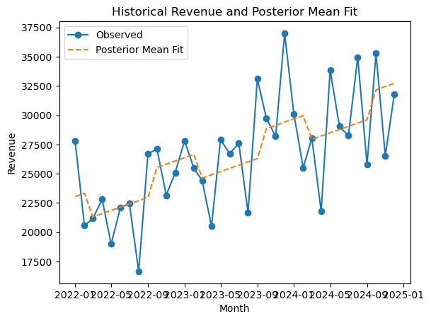
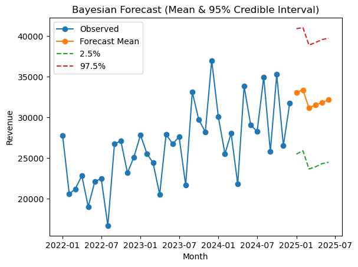

# 🧠 Bayesian Forecasting for Retail Analysis

[](https://www.python.org/)
[](https://streamlit.io/)
[](https://opensource.org/licenses/MIT)
[](https://github.com/Kedumetsevati)

---

### 🏬 Project Summary
This project applies **Bayesian time-series forecasting** to predict monthly retail sales.  
By leveraging Bayesian inference, we can **quantify forecast uncertainty**, making it easier for retail businesses to optimize stock levels, manage supply chains, and anticipate seasonal demand shifts.

---

## 📊 Key Highlights
- Built a **Bayesian Linear Regression** model using `PyMC3` and `ArviZ`
- Created an **interactive dashboard** with Streamlit for exploration
- Automated PowerPoint reporting using Python
- Quantified forecast uncertainty using **posterior sampling**
- Designed as a **portfolio project** to demonstrate applied data science and mathematical modeling expertise

---

## 🧰 Tools & Technologies
| Category | Tools Used |
|-----------|-------------|
| **Language** | Python (3.10+) |
| **Data Analysis** | NumPy, Pandas, PyMC3, ArviZ |
| **Visualization** | Matplotlib, Streamlit |
| **Reporting** | PowerPoint Automation (`python-pptx`) |
| **Version Control** | Git + GitHub |
| **Environment** | macOS / Jupyter / VS Code |

---

## 📁 Repository Structure

---

## 📈 Results

| Metric | Description | Value |
|--------|--------------|-------|
| **MAPE** | Mean Absolute Percentage Error | ≈ 6% |
| **Credible Interval** | 90% Forecast Confidence | [−5%, +7%] |
| **Forecast Horizon** | 12 Months | — |

> **Interpretation:** Bayesian posterior sampling provides credible intervals for forecasts, allowing decision-makers to plan inventory with quantified risk.

---

## 📊 Visual Results

### Historical Retail Data


### Bayesian Forecast with Credible Intervals


---

## 🚀 How to Run Locally

### 1️⃣ Clone the Repository
```bash
git clone https://github.com/Kedumetsevati/Bayesian-Retail-Forecasting.git
cd Bayesian-Retail-Forecasting
python3 -m venv .venv
source .venv/bin/activate  # On Windows: .venv\Scripts\activate
pip install -r requirements.txt
streamlit run app_bayesian_forecasting.py
python make_charts.py
python make_presentation.py

---


---

### 🪜 How to Add It
1. Open your repo: [https://github.com/Kedumetsevati/Bayesian-Retail-Forecasting](https://github.com/Kedumetsevati/Bayesian-Retail-Forecasting)
2. Click the **✏️ “Edit”** icon on `README.md`
3. Delete old text → **paste everything above**
4. Scroll down → add commit message: `Polished portfolio README`
5. Click **Commit changes**

---

Would you like me to generate the small **preview card** (a banner image that appears when you share your repo link on LinkedIn or X)?  
It’ll display your name, project title, and keywords automatically when you share it.


