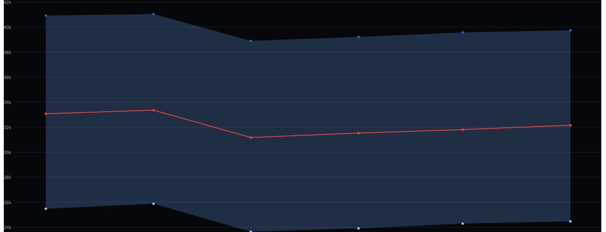
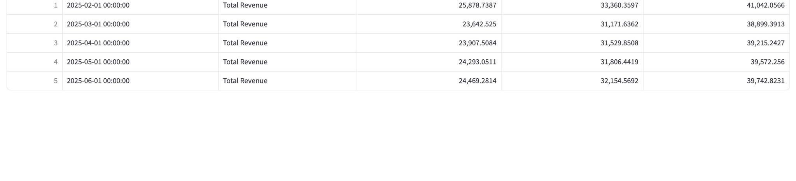
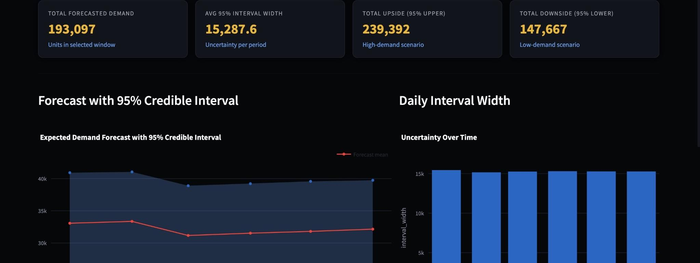

# 🧠 Bayesian Forecasting for Retail Analysis  
### Probabilistic Demand Forecasting for Retail Sales Optimization

---

## 📘 Project Overview  
This project applies **Bayesian time-series forecasting** to predict retail sales and quantify uncertainty for improved operational planning.  
Using posterior predictive distributions instead of point forecasts, the model provides **credible intervals**—helping reduce stockouts, overstock, and inventory risk.

This approach is directly applicable to retail chains like **Costco**, where understanding upside/downside demand risk is essential for supply-chain decisions.

---

## 🎯 Objectives
- 📈 Build a Bayesian forecast model capturing trend, seasonality, and uncertainty  
- 🛒 Improve stock allocation and reorder accuracy  
- 📊 Visualize demand forecasts and credible intervals  
- 💡 Provide a decision-support tool using a Streamlit dashboard  

---

## 🧰 Tools & Technologies
| Category | Tools |
|---------|-------|
| Languages | Python (Pandas, NumPy) |
| Statistical Modeling | PyMC3 / Bayesian Regression / MCMC |
| Visualization | Matplotlib, Plotly, Power BI |
| Dashboard | Streamlit |
| Development | VS Code, GitHub |
| Dataset | Synthetic retail dataset or Kaggle retail data |

---

## 📂 Project Structure   

## 📸 Dashboard Preview

### Forecast with 95% Credible Interval

### Recommendations Table

### Dashboard Overview

---

